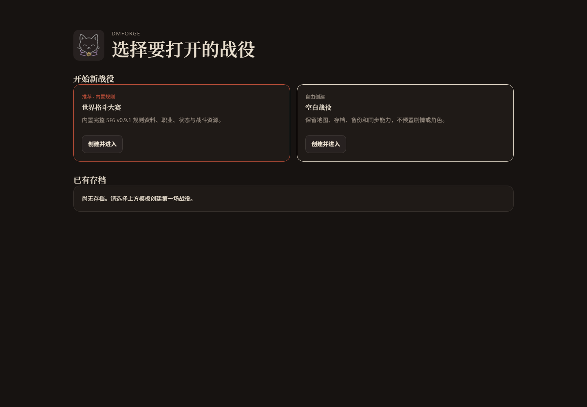
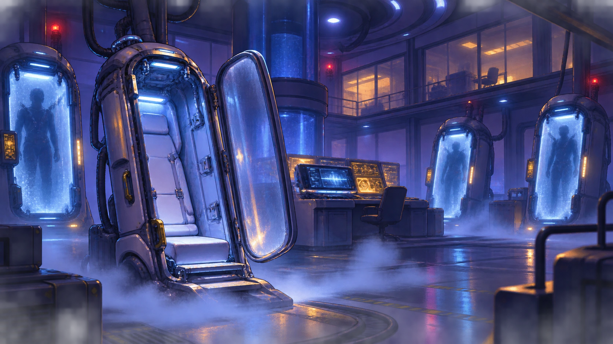

# DMForge

**A local-first campaign, tactical-map, and presentation workspace for tabletop role-playing games.**

**Un espace local de gestion de campagne, de carte tactique et de présentation pour les jeux de rôle sur table.**

[English](#english) · [Français](#français)



---

## English

### Problem

Running a tactical tabletop role-playing campaign usually requires several disconnected tools: character sheets, battle maps, initiative trackers, inventory notes, fog-of-war utilities, rule references, and a separate screen for players or streaming. This fragmentation slows down the game, creates inconsistent information between the Game Master and players, and makes recovery difficult when a browser tab, local file, or network connection fails.

DMForge brings campaign preparation, live tactical control, player presentation, and recoverable local storage into one application. It remains usable without Docker, an internet connection, or a third-party account.

### Users

- **Game Masters / Dungeon Masters** preparing maps, characters, encounters, notes, rules, items, enemies, and cutscenes.
- **Players at the table** using a read-only tactical map and public character information.
- **Remote participants and spectators** watching the presentation window through Discord, a television, projector, or screen-sharing software.
- **Campaign authors** creating original rules, bestiaries, item catalogues, and reusable templates.
- **Small local groups** wanting LAN synchronisation without a public cloud service.

The current application and bundled SF6 campaign primarily serve a Chinese-speaking play group; repository documentation is provided in English and French.

### Requirements

#### Core functions

- One launch method that uses LAN synchronisation when available and falls back to standalone local use.
- Campaign selection with a built-in SF6 campaign and a blank-campaign option.
- Tactical maps with centred tokens, multiple creature sizes, A* routes, movement costs, walls, doors, windows, furniture, cover, traps, and destructible components.
- Lighting, flashlights, line of sight, fog-of-war memory, manual vision controls, and a separate DM-only preview.
- Round-based combat with initiative, resources, conditions, rests, movement limits, and defeated-enemy cleanup.
- Native and imported character sheets, avatar cropping, derived values, attacks, feats, skills, inventory, and encumbrance.
- A structured enemy bestiary, multilingual random names, reusable templates, and direct placement.
- A world item pool with equipment, consumables, weight, calories, armour bonuses, damage values, transfers, and long-rest rations.
- A player/presentation window for maps, combat, party overview, cutscenes, pause screens, public character details, and filtered history.
- Automatic and manual backups, encrypted exports, schema migration, validation, conflict handling, and recovery points.
- A searchable rules library and a detailed in-application DMForge guide.

#### Constraints

- Node.js 22 or a compatible newer version.
- Validated campaign JSON is limited to 10 MB.
- Only trusted `.xlsx`, `.xls`, `.xlsm`, and `.xlsb` files should be imported; file, sheet, row, and column limits are enforced.
- LAN synchronisation is single-process and file-backed, with separate Game Master write and player read-only tokens.
- There is no public account system, hosted database, or field-level collaborative merge.
- Plain HTTP is intended for trusted LANs; configure HTTPS for less trusted networks.
- ETag conflicts stop synchronisation until the Game Master chooses the local or server version.
- Server campaign files and rolling backups are local plain-text JSON; use password-encrypted exports for off-device transfer.

### Solution

DMForge provides three connected surfaces:

1. **Game Master workspace** — campaign editing, encounters, maps, vision, notes, logs, items, bestiary, rules, backups, and presentation direction.
2. **Player view** — a read-only map and public-information surface that cannot overwrite campaign data.
3. **Presentation view** — an isolated local window for streaming or projection, with scene selection, camera following, collapsible sidebars, filtered information, and reconnection handling.

The local-first storage design uses transactional IndexedDB snapshots in the browser and atomic versioned JSON files in the Node service. It keeps rolling backups, automatically falls back to local mode, detects sync conflicts, and supports SHA-256-checked exports with optional AES-256-GCM encryption. Large JSON operations run in Web Workers to reduce interface stalls.

The default campaign adds structured SF6 rules, original story content, character creation, enemies, items, three tactical maps, cutscenes, and campaign artwork. Blank campaigns keep the general tools without campaign-specific rules or content.

#### Quick start

On Windows, double-click `run.bat`. For development:

```bash
npm ci
npm run dev
```

Open `http://127.0.0.1:5173`.

For LAN access:

```powershell
$env:DMFORGE_HOST='0.0.0.0'
$env:DMFORGE_SYNC_TOKEN='replace-with-a-long-random-write-token'
$env:DMFORGE_READ_TOKEN='replace-with-a-different-read-only-token'
npm run dev
```

Docker remains optional through `run-docker.bat`.

#### Windows portable build

```powershell
powershell -NoProfile -ExecutionPolicy Bypass -File .\scripts\build-portable.ps1
```

The build produces `release/DMForge-portable/` and a Windows x64 ZIP. After extraction, `DMForge.exe` runs without Node.js, npm, or Docker on the target computer. Run `install-start-menu.bat` to add a Start menu shortcut.

### Technology

| Area | Technology | Purpose |
|---|---|---|
| Interface | React 19, JavaScript, JSX, HTML5, CSS | Game Master, player, presentation, character-sheet, and rules-library interfaces |
| Build | Vite 8 | Development server, production build, assets, and code splitting |
| Local service | Node.js HTTP service | Local API, LAN sync, backups, tokens, and static delivery |
| Tactical system | `react-zoom-pan-pinch`, custom geometry, A* | Camera, routes, creature footprints, movement cost, and collisions |
| Browser storage | IndexedDB and limited `localStorage` | Transactional snapshots and settings |
| Server storage | Versioned JSON files | Atomic persistence and rolling backups |
| API | JSON endpoints such as `/api/campaign` and `/api/backups` | Synchronisation, ETags, backup listing, and restoration |
| Spreadsheets | SheetJS `xlsx` and Web Workers | Trusted character-sheet and reference imports |
| Graphics | SVG, PNG, WebP | Branding, icons, tactical furniture, maps, and cutscenes |
| Security | Web Crypto, AES-256-GCM, SHA-256, schema validation | Encryption, integrity, migration, and unsafe-data rejection |
| Testing | Node test runner, ESLint, Vite build, browser review | Logic, quality, integration, and visual verification |

**SQL:** not used in the current release. IndexedDB and validated JSON match the standalone/small-LAN workflow.

**XML:** not used as an application data format; SVG assets are XML-based graphics.

**API:** DMForge exposes a small local JSON API, not a public cloud API.

**AI tools:** used during development, but no AI model is required at runtime and no campaign data is automatically sent to an AI service.

### Testing

```bash
npm run verify
```

The quality gate runs ESLint, automated Node tests, standalone player-sheet generation, and a production Vite build. The current verified baseline contains **125 passing tests** covering persistence, migration, encrypted exports, recovery, sync decisions, character calculations, enemies, inventory, movement, pathfinding, terrain, doors, vision, fog memory, presentation filtering, camera sync, player-sheet builds, and guide parsing.

Fixes follow this process:

1. Reproduce the smallest reliable failure.
2. Add a deterministic regression test where possible.
3. Correct the underlying state, geometry, validation, synchronisation, or rendering rule.
4. Run the focused test and then `npm run verify`.
5. Perform browser checks for layout, map interaction, long text, camera behaviour, and responsive density.
6. Preserve a recovery path before destructive import, restore, reset, or sync operations.

### Screenshots / Demo

#### Actual application start screen

Captured from the current local build at `1440 × 1000`:


#### Bundled tactical-map example


#### Bundled cutscene example



For an interactive demo, run `npm ci` and `npm run dev`, create **World Fighting Tournament**, open **Tactical Map**, and use **Player View** or **Presentation Window**. The standalone player sheet is available at `/player-character-sheet.html` and in `player-sheet-dist/`.

### Your contribution

The project owner:

- Defined the product problem, tabletop workflow, priorities, and acceptance criteria.
- Authored the SF6-inspired rules, original campaign world, chapters, encounters, items, enemies, and narrative direction.
- Chose the local-first/LAN-fallback model instead of requiring Docker or a hosted service.
- Directed map, combat-resource, fog-memory, player-information, presentation, character-sheet, and backup interactions.
- Selected and refined the cat-and-die identity, colours, icons, map artwork, and interface density.
- Supplied rulebooks, character workbooks, campaign notes, saves, and reproducible defect reports.
- Reviewed the running application, rejected unsuitable changes, and made final product decisions.
- Required recovery points, explicit conflict resolution, read-only player access, privacy filtering, and regression testing.

The repository records the resulting engineering work: architecture, components, tactical geometry, visibility rules, validation, synchronisation, backup systems, tests, assets, documentation, and packaging. AI-assisted changes were accepted only after owner review and automated or visual verification.

### AI usage

AI tools assisted with requirements analysis, implementation planning, React and utility code, regression tests, documentation, geometry and visibility analysis, visual concepts, campaign artwork, icons, map assets, UI-density review, and targeted debugging.

AI output was verified through source review, comparison with the owner's rules, deterministic tests, production builds, browser checks, validation against supplied PDF/Excel/save data, Git history, rollback documentation, recoverable backups, and owner approval.

No AI model runs inside DMForge, no AI account is required, and DMForge does not automatically transmit campaign content to an AI provider.

### Additional documentation

- [Complete DMForge user guide](docs/DMFORGE_MAIN_PAGE_INSTRUCTIONS.md)
- [Character-card import notes](docs/character-card-import.md)
- [Frontend rollback reference](docs/frontend/UI_ROLLBACK.md)

---

## Français

### Problème

Une campagne tactique de jeu de rôle utilise souvent plusieurs outils séparés : fiches de personnage, cartes, initiative, inventaire, notes, brouillard de guerre, règles et écran de diffusion. Cette fragmentation ralentit la partie, crée des informations incohérentes entre le maître de jeu et les joueurs et complique la récupération après une panne de fichier, d'onglet ou de réseau.

DMForge réunit préparation, contrôle tactique en direct, affichage joueur et stockage local récupérable. L'application reste utilisable sans Docker, sans Internet et sans compte tiers.

### Utilisateurs

- **Maîtres de jeu** préparant cartes, personnages, rencontres, notes, règles, objets, ennemis et cinématiques.
- **Joueurs autour de la table** utilisant une carte et des informations publiques en lecture seule.
- **Participants à distance et spectateurs** regardant la fenêtre de présentation par Discord, téléviseur, projecteur ou partage d'écran.
- **Auteurs de campagnes** créant règles originales, bestiaires, catalogues et modèles réutilisables.
- **Petits groupes en réseau local** souhaitant une synchronisation LAN sans cloud public.

L'application et la campagne SF6 intégrée servent principalement un groupe sinophone ; la documentation du dépôt est en anglais et en français.

### Exigences

#### Fonctions principales

- Un seul lancement, avec synchronisation LAN lorsqu'elle est disponible et repli automatique en mode local.
- Sélection d'une campagne SF6 intégrée ou d'une campagne vide.
- Cartes tactiques avec pions centrés, tailles multiples, itinéraires A*, coûts de déplacement, murs, portes, fenêtres, mobilier, couverts, pièges et objets destructibles.
- Éclairage, lampe torche, lignes de vue, mémoire du brouillard, contrôle manuel et aperçu réservé au maître de jeu.
- Combat par rounds avec initiative, ressources, états, repos, limites de déplacement et suppression des ennemis vaincus.
- Fiches natives ou importées, recadrage d'avatar, valeurs calculées, attaques, dons, compétences, inventaire et encombrement.
- Bestiaire structuré, noms aléatoires multilingues, modèles réutilisables et placement direct.
- Réserve mondiale d'objets avec équipement, consommables, poids, calories, armure, dégâts, transferts et rations.
- Fenêtre joueur/de présentation pour cartes, combat, groupe, cinématiques, pause, détails publics et historique filtré.
- Sauvegardes automatiques et manuelles, exports chiffrés, migration, validation, conflits et points de récupération.
- Bibliothèque de règles et guide DMForge détaillé avec recherche.

#### Contraintes

- Node.js 22 ou version compatible plus récente.
- Campagne JSON validée limitée à 10 Mo.
- Import uniquement de classeurs `.xlsx`, `.xls`, `.xlsm` et `.xlsb` fiables, avec limites de taille et de contenu.
- Synchronisation LAN mono-processus sur fichiers, avec jetons distincts d'écriture et de lecture seule.
- Aucun compte public, base hébergée ou fusion collaborative champ par champ.
- HTTP réservé aux LAN de confiance ; HTTPS recommandé ailleurs.
- Les conflits ETag interrompent la synchronisation jusqu'au choix du maître de jeu.
- Les fichiers serveur sont du JSON local en clair ; utiliser les exports chiffrés pour les transferts externes.

### Solution

DMForge propose trois surfaces :

1. **Espace du maître de jeu** — campagne, rencontres, cartes, vision, notes, journaux, objets, bestiaire, règles, sauvegardes et diffusion.
2. **Vue joueur** — carte et informations publiques en lecture seule, sans écriture dans la campagne.
3. **Vue de présentation** — fenêtre locale isolée pour diffusion ou projection, avec scènes, suivi de caméra, panneaux repliables, filtrage et reconnexion.

Le stockage local utilise des instantanés IndexedDB transactionnels et des fichiers JSON versionnés écrits atomiquement par le service Node. DMForge conserve des sauvegardes tournantes, revient au mode local en cas de panne réseau, détecte les conflits et propose des exports contrôlés par SHA-256 avec chiffrement AES-256-GCM facultatif. Les opérations JSON importantes utilisent des Web Workers.

La campagne par défaut contient règles SF6 structurées, histoire originale, personnages, ennemis, objets, trois cartes, cinématiques et illustrations. Une campagne vide conserve uniquement les outils généraux.

#### Démarrage rapide

Sous Windows, double-cliquez sur `run.bat`. Pour le développement :

```bash
npm ci
npm run dev
```

Ouvrez `http://127.0.0.1:5173`.

Pour l'accès LAN :

```powershell
$env:DMFORGE_HOST='0.0.0.0'
$env:DMFORGE_SYNC_TOKEN='remplacer-par-un-long-jeton-ecriture-aleatoire'
$env:DMFORGE_READ_TOKEN='remplacer-par-un-autre-jeton-lecture-seule'
npm run dev
```

Docker reste facultatif avec `run-docker.bat`.

#### Version portable Windows

```powershell
powershell -NoProfile -ExecutionPolicy Bypass -File .\scripts\build-portable.ps1
```

La construction produit `release/DMForge-portable/` et une archive ZIP Windows x64. Après extraction, `DMForge.exe` fonctionne sans Node.js, npm ou Docker sur l'ordinateur cible. `install-start-menu.bat` ajoute un raccourci au menu Démarrer.

### Technologie

| Domaine | Technologie | Utilisation |
|---|---|---|
| Interface | React 19, JavaScript, JSX, HTML5, CSS | Interfaces maître de jeu, joueur, présentation, fiches et règles |
| Construction | Vite 8 | Développement, production, ressources et découpage du code |
| Service local | Service HTTP Node.js | API locale, LAN, sauvegardes, jetons et fichiers statiques |
| Système tactique | `react-zoom-pan-pinch`, géométrie, A* | Caméra, itinéraires, empreintes, coûts et collisions |
| Stockage navigateur | IndexedDB et `localStorage` limité | Instantanés et réglages |
| Stockage serveur | Fichiers JSON versionnés | Persistance atomique et sauvegardes tournantes |
| API | `/api/campaign`, `/api/backups` en JSON | Synchronisation, ETags, sauvegarde et restauration |
| Tableurs | SheetJS `xlsx`, Web Workers | Import de fiches et de références fiables |
| Graphisme | SVG, PNG, WebP | Identité, icônes, mobilier, cartes et cinématiques |
| Sécurité | Web Crypto, AES-256-GCM, SHA-256, validation | Chiffrement, intégrité, migration et rejet des données dangereuses |
| Tests | Tests Node, ESLint, Vite, contrôle navigateur | Logique, qualité, intégration et visuel |

**SQL :** non utilisé ; IndexedDB et JSON validé conviennent au fonctionnement autonome/LAN.

**XML :** non utilisé comme format de données ; les SVG sont des graphismes fondés sur XML.

**API :** petite API JSON locale, pas d'API cloud publique.

**Outils d'IA :** utilisés pendant le développement, mais aucun modèle n'est requis à l'exécution et aucune campagne n'est envoyée automatiquement à un service d'IA.

### Tests

```bash
npm run verify
```

Ce contrôle lance ESLint, les tests Node, la génération de la fiche joueur et la construction Vite. La référence actuelle contient **125 tests réussis** couvrant persistance, migration, chiffrement, récupération, synchronisation, personnages, ennemis, inventaire, déplacement, A*, terrain, portes, vision, mémoire du brouillard, présentation, caméra, fiche autonome et guide.

Processus de correction :

1. Reproduire le défaut avec le scénario minimal fiable.
2. Ajouter un test de non-régression déterministe lorsque possible.
3. Corriger la règle d'état, de géométrie, de validation, de synchronisation ou de rendu.
4. Exécuter le test ciblé puis `npm run verify`.
5. Contrôler dans le navigateur la mise en page, les cartes, les textes longs, la caméra et le responsive.
6. Préserver une récupération avant import, restauration, réinitialisation ou synchronisation destructrice.

### Captures d'écran / Démonstration

#### Écran réel de démarrage

Capture de la version locale actuelle en `1440 × 1000` :


#### Exemple de carte tactique intégrée


#### Exemple de cinématique intégrée


Pour la démonstration interactive, exécutez `npm ci` puis `npm run dev`, créez **World Fighting Tournament**, ouvrez **Tactical Map** et utilisez **Player View** ou **Presentation Window**. La fiche autonome est disponible à `/player-character-sheet.html` et dans `player-sheet-dist/`.

### Votre contribution

Le propriétaire du projet :

- A défini le problème, le déroulement, les priorités et les critères d'acceptation.
- A écrit les règles inspirées de SF6, l'univers original, les chapitres, rencontres, objets, ennemis et la direction narrative.
- A choisi le modèle local avec repli LAN plutôt qu'une dépendance à Docker ou à un service hébergé.
- A dirigé les interactions de carte, combat, mémoire du brouillard, informations joueur, présentation, fiches et sauvegardes.
- A sélectionné et affiné l'identité du chat et du dé, les couleurs, icônes, cartes et la densité de l'interface.
- A fourni livres de règles, classeurs, notes, sauvegardes et rapports de défauts reproductibles.
- A contrôlé l'application, rejeté les changements inadaptés et pris les décisions finales.
- A exigé récupération, conflits explicites, lecture seule, confidentialité et tests de non-régression.

Le dépôt conserve le travail d'ingénierie résultant : architecture, composants, géométrie, visibilité, validation, synchronisation, sauvegardes, tests, ressources, documentation et empaquetage. Les changements assistés par IA n'ont été acceptés qu'après vérification par le propriétaire et contrôle automatisé ou visuel.

### Utilisation de l'IA

Les outils d'IA ont aidé à analyser les exigences, planifier l'implémentation, rédiger et restructurer composants React, modules, tests et documentation, analyser géométrie et vision, produire certains concepts et éléments visuels sous direction artistique, examiner la densité de l'interface et cibler les régressions.

Les résultats ont été vérifiés par relecture du code, comparaison avec les règles du propriétaire, tests déterministes, constructions de production, contrôles navigateur, validation avec PDF/Excel/sauvegardes fournis, historique Git, documentation de retour arrière et approbation finale.

Aucun modèle d'IA ne s'exécute dans DMForge, aucun compte d'IA n'est requis et aucun contenu de campagne n'est transmis automatiquement à un fournisseur d'IA.

### Documentation complémentaire

- [Guide complet d'utilisation de DMForge](docs/DMFORGE_MAIN_PAGE_INSTRUCTIONS.md)
- [Notes d'importation des fiches](docs/character-card-import.md)
- [Référence de retour arrière de l'interface](docs/frontend/UI_ROLLBACK.md)
